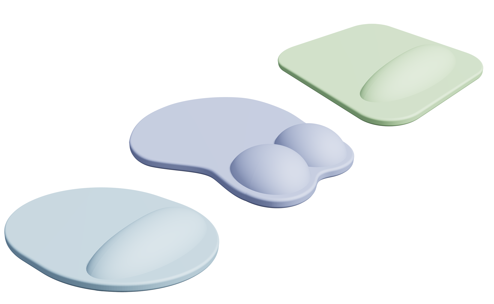

# 3D MousePad Studio

基于 Three.js 的浏览器端 3D 鼠标垫设计工具。所有参数实时调节，支持远超市售客制化 3D 鼠标垫实物的外形参数，供爱好者玩耍。



> 考虑贴图合规性，仅渲染纯色模型示意

## 运行

直接用浏览器打开 `index.html` 即可（无需构建）。

```bash
# 若浏览器对本地模块有限制，可用任意静态服务器打开
npx serve .      # 然后访问提示的地址
# 或直接 python
python -m http.server 8000
```

> 依赖通过 CDN（importmap）加载，需要联网首次加载。

## 主要功能

- **外形（shape）**：经典（贝塞尔锚点可拖拽编辑）、椭圆、圆角矩形、跑道形。
- **腕托（wristStyle）**：整体腕托（肾形变形）、双球、无。
- **经典轮廓编辑**：开启"编辑轮廓"后可在画布上拖拽贝塞尔锚点与手柄，自定义鼠标垫上半轮廓；点击"重置锚点"恢复出厂默认外形。
- **鼠标垫超出腕托（wMargin）**：控制垫面相对腕托外扩的距离。
- **材质 / 贴图**：底色、不透明度、表面粗糙度，以及贴图（cover / cutout）混合。
- **灯光 / 背景 / 导出**：方向光、环境光、背景颜色、透明背景、导出倍率。

## 备注

- 改完参数后几何会重建（`rebuild()`），材质颜色 / 透明度等仅实时更新、不重建几何。
- 经典款外形由 `classicCtrl` 锚点链驱动；拖拽编辑后"重置锚点"可恢复 `DEFAULT_CLASSIC_CTRL` 出厂外形。
- 导入 `.json` 或 `.zip` 配置后会同步所有控件值及分组显隐（如腕托款式、边缘同色、形状类型）；导入旧版 `{p:{x,y}}` 嵌套格式锚点会自动兼容。
- 导出图片使用 `preserveDrawingBuffer`，建议通过界面内"导出"按钮保存。
- 配置名称含非法字符（`\/:*?"<>|` 等）会被清理，空格转下划线；留空时文件名回退为 `mousepad-config`。
