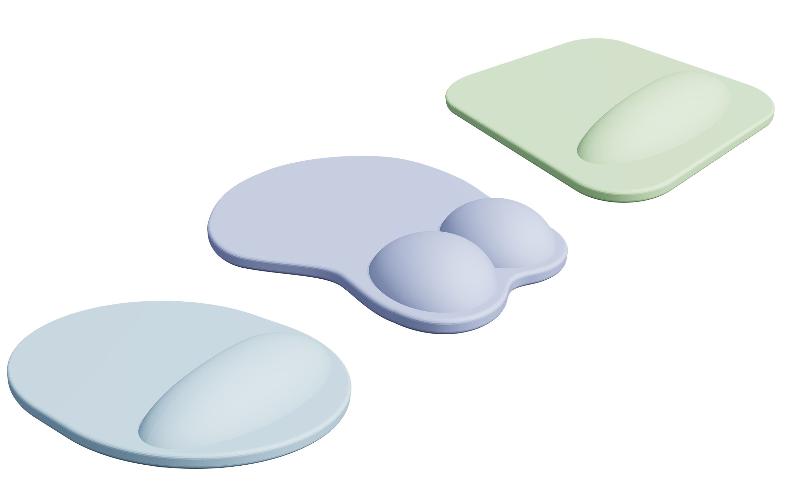

# 3D MousePad Studio

基于 Three.js 的浏览器端 3D 鼠标垫设计工具。所有参数实时调节，支持远超市售客制化 3D 鼠标垫实物的外形参数，供爱好者玩耍。



> 考虑贴图合规性，仅渲染纯色模型示意

## 运行

页面是**原生 ES module**（`index.html` + `src/*.js`），无需构建，但需要经 HTTP 打开 ——
浏览器的模块加载在 `file://` 下会被 CORS 拦住。

```bash
node server.js             # 然后访问 http://localhost:5213
# 或任意静态服务器
npx serve .
python -m http.server 8000
```

> 依赖通过 CDN（importmap）加载，首次加载需要联网。

## 主要功能

- **外形（shape）**：经典（贝塞尔锚点可拖拽编辑）、椭圆、圆角矩形、跑道形。
- **腕托（wristStyle）**：整体腕托（肾形变形）、双球、无。
- **经典轮廓编辑**：开启"编辑轮廓"后可在画布上拖拽贝塞尔锚点与手柄，自定义鼠标垫上半轮廓；点击"重置锚点"恢复出厂默认外形。
- **鼠标垫超出腕托（wMargin）**：控制垫面相对腕托外扩的距离。
- **材质 / 贴图**：底色、不透明度、表面粗糙度，以及贴图（cover / cutout）混合。
  贴图任一边超过 4096px 时不会直接报错，而是弹出裁剪 / 压缩界面：可拖拽裁剪框（含比例锁定）、
  用「长边裁剪」滑条把图压小、设定 PNG/JPEG 格式，确认后写入合规的贴图；取消则保持原状。
- **灯光 / 背景 / 导出**：方向光、环境光、背景颜色、透明背景、导出倍率。
- **本地保存**：参数改动自动存为草稿（防抖 600ms），刷新页面后恢复；也可命名保存成多个方案槽位（含贴图，存 IndexedDB），随时载入 / 删除。
- **界面语言**：右上角「English / 中文」按钮切换，语言偏好记在 localStorage。文案全部走 `src/i18n.js` 的词典，没有硬编码。
- **移动端 / 窄屏**：宽屏为常驻左栏，窄屏（≤900px）自动改为覆盖式参数抽屉，画布占满屏幕。
  开合抽屉有三个入口：工具栏里的「⚙ 参数」（在「配置」左边）、贴在抽屉右缘的折叠把手「▶ / ◀」，
  以及点遮罩或按 Esc 收起。抽屉展开时盖住工具栏，不会露出半透明按钮；
  触摸操作支持单指旋转视角、双指缩放 / 旋转贴图（张开手指放大、收拢缩小，旋转方向随手势；
  都以两指中点为准：中点下的贴图像素在缩放时保持不动），
  滑条等控件命中区域按手指尺寸放大。桌面端贴图编辑模式下滚轮缩放、Shift+滚轮旋转，
  滚轮**向上 = 放大**（与捏合张开同向），锚点同样是鼠标位置。
- **导出图片**：预览图（当前画面）与模型渲染图（保持当前视角、透明背景、画面自动贴合模型外接矩形）。
- **导出 3D 模型**：GLB（含材质与贴图，1 单位 = 1m，符合 glTF 米制约定）、STL / OBJ（仅几何，1 单位 = 1mm，可直接送 3D 打印或建模软件）。腕托在渲染中被裁掉的部分会在导出时落实为平底，保证网格水密。

## Demo 页

`demo/` 下有两个独立的对比页，仅供方案评估，与主工程无代码耦合，浏览器直接打开即可：

| 文件 | 用途 |
| --- | --- |
| `demo/curvetest.html` | 曲线算法对比（Catmull-Rom 锚点 vs 真贝塞尔手柄） |
| `demo/sidetest.html` | 侧边（边缘）方案对比：五种侧壁生成方案 + 纯色 / 贴图两种观感，不接腕托 |

## 源码结构

零构建，原生 ES module。`index.html` 持有唯一的 `<script type="module">`，其余按职责拆开：

```
index.html     页面骨架 + 渲染 / 交互 / 导出（唯一读写 three 与 DOM 的地方）
src/util.js          零依赖工具（norm2 / clampNum / 点路径读写）
src/params.js        参数默认值 + PARAM_SCHEMA（含 onChange 变更意图）+ 白名单校验  ← 纯逻辑
src/config.js        ZIP(store) 打包解包 / 安全文件名 / 版本迁移骨架              ← 纯逻辑
src/textureMath.js   裁剪压缩计算 + 锚点缩放反解                                  ← 纯逻辑
src/anchors.js       经典款贝塞尔锚点：烘焙 / 平滑 / 校验                         ← 纯数学
src/footprint.js     腕托足迹：采样 / 等距外扩 / 去自交 / 双球过渡弧              ← 纯几何
src/store.js         localStorage（草稿 + 槽位索引）+ IndexedDB（贴图 / 方案本体）
src/i18n.js          中英词典与语言切换
```

> ⚠️ 标「纯逻辑 / 纯数学 / 纯几何」的模块**不得 import three**：它们要能在 `npm run unit`
> 里被 node 直接 import（秒级反馈）。一旦引入 three，就只能靠浏览器 + CDN，反馈环退化到分钟级。

## 开发 / 回归验证

项目无构建，回归分两层 —— **先跑快的**：

```bash
npm install                    # 首次：装 playwright
npx playwright install chromium

npm run unit                   # 纯函数级：约 1 秒，88 项断言
npm run smoke                  # 浏览器冒烟：约 2 分钟，203 项断言
npm test                       # 两层都跑
```

### 1. 纯函数级（`test/unit/`，`node:test`）

`src/` 下的 `util / params / config / textureMath / anchors / footprint` 都**不 import three**，
所以能在 node 里直接 import，不必开浏览器、不必等 3.5s CDN。改参数校验、配置迁移、
贴图裁剪压缩、锚点烘焙、腕托足迹时，先在这里加断言 —— 反馈从分钟级降到毫秒级。

| 文件 | 覆盖 |
| --- | --- |
| `test/unit/params.test.mjs` | 白名单校验：未知字段丢弃、完整快照语义、越界夹紧、NaN/Infinity 拦截、颜色格式、classicCtrl 结构与旧版 `{p:{x,y}}` 兼容、版本迁移骨架 |
| `test/unit/config.test.mjs` | ZIP（store）往返、deflate 条目被拒、CRC 不匹配被拒、目录越界、安全文件名、体积上限 |
| `test/unit/textureMath.test.mjs` | 裁剪尺寸、只缩不放、滑条量程取长边、软上限兜底、锁比例夹取、全选内接矩形、锚点缩放反解（锚点下的贴图像素不动） |
| `test/unit/anchors.test.mjs` | 锚点烘焙落在接缝、端点切线 G1、手柄共线、非法锚点重烘焙、接缝平移只动两端 |
| `test/unit/footprint.test.mjs` | 足迹采样方向、等距外扩、去自交、双球过渡弧连续性、布局基准与旋转无关 |
| `test/unit/i18n.test.mjs` | 中英词典 key 完全一致（缺词会在界面上露出原始 key）、占位符替换、存储不可用时不抛 |

### 2. 浏览器冒烟（`test/smoke-*.mjs`，Playwright + SwiftShader）

只在**真的需要渲染 / 布局 / 手势**时才跑。脚本自举本地静态服务（随机端口），不需要先起服务器。

| 脚本 | 覆盖 |
| --- | --- |
| `test/smoke-render.mjs` | 渲染器启动、按需渲染、LOD 预览、编辑态相机锁定、预览图导出后状态复原、侧壁焊接与折痕法线（方案 A）、配置导入校验（合法 / 越界 / 未知字段 / 非配置文件 / 损坏 ZIP / 坏图片） |
| `test/smoke-export.mjs` | 环境贴图未被误释放、阴影按需更新、导入清贴图、GLB/STL/OBJ 导出非空、模型渲染图导出后画面复原 |
| `test/smoke-texfix.mjs` | 超尺寸贴图弹出裁剪 / 压缩界面：默认 1:1 原样、读数给出「原图 → 裁剪 → 压缩」分段分辨率、裁剪框决定输出、长边裁剪滑条只压缩不放大（含 4:3 与 3:4 的滑条量程）、PNG/JPEG 格式与比例锁定、全选与「1 : 1」、应用后写入合规贴图、取消不留半截状态、小图不触发 |
| `test/smoke-mobile.mjs` | 窄屏/横屏/平板/桌面四档布局、工具栏不重叠、参数按钮在工具栏内的位置、抽屉开合（参数按钮 / 折叠把手 / 遮罩三条路径）与层级（抽屉盖住工具栏）、画布尺寸与 CSS 盒子同步、触控命中尺寸、viewport 与 touch-action、双指旋转方向、捏合缩放的方向（张开=放大）与锚点 |
| `test/smoke-zoomwheel.mjs` | 滚轮缩放方向：向上=放大（`tp.s` 变小、画面红半边变宽）、与捏合「张开=放大」同向、锚点仍是鼠标位置、Shift+滚轮仍走旋转、视角模式下不写贴图参数 |
| `test/smoke-i18n-store.mjs` | 界面无裸露 i18n key、切英文后标签/按钮/占位/悬停说明全变、切语言不重建几何、语言偏好被记住、自动草稿落盘与刷新恢复、方案槽位的保存 / 载入 / 删除 / 空态 |

`test/_harness.mjs` 是公共装置（静态服务 + 浏览器启动 + 断言收集），新增用例请复用它。

> - ⚠️ harness 里 `locale` 固定为 `zh-CN`：i18n 会读 `navigator.language` 决定初始语言，不锁住的话所有"按中文文案找控件"的断言会集体失效。
> - 脚本依赖 CDN 加载 Three.js，需联网；SwiftShader 是纯软件渲染，比真实 GPU 慢，单脚本约 1 分钟属正常。
> - 断言名一律自解释，不要写「P0-1」「缺陷 9」这类编号 —— 它们指向临时文档，删掉后编号便无处可查。历史来历请写在注释里。
> - 调试单个脚本：`node test/smoke-render.mjs`。

## 单位约定

所有长度参数与场景世界坐标均为**毫米**（1 世界单位 = 1mm）。默认 `基础宽度 230 × 基础长度 265` 即一块 230mm × 265mm 的鼠标垫。

导出模型时：STL / OBJ 按 mm 写出（1 单位 = 1mm，可直接送打印）；GLB 按 glTF 米制规范缩放为 1 单位 = 1m。

> ⚠️ 倒角会让成品比参数大，故界面上这三个控件名为 **基础宽度 / 基础长度 / 基础厚度**，指的是**倒角前**的轮廓尺寸（悬停可看换算公式）：
> - 成品外廓 = `基础宽度` / `基础长度` + `1.8 × 边缘倒角`
> - 成品总厚 = `基础厚度` + `2 × 边缘倒角`
>
> 默认参数（230 × 265、基础厚度 1、边缘倒角 3）下实际成品为 **235.4 × 270.4 × 7 mm**。

## 备注

- **新增参数要登记两处**：`PARAM_SCHEMA`（导入白名单）与它的 `onChange`（变更后该重建还是只刷材质）。两者缺一都会在启动时被自检点名。
- **新增界面文案要同时补中英两份**：`src/i18n.js` 的缺词会让页面直接显示 `panel.shape` 这种原始 key，`npm run unit` 会拦住。
- 改完参数后几何会重建（`rebuild()`），材质颜色 / 透明度等仅实时更新、不重建几何 —— 走 `PARAM_SCHEMA[key].onChange` 分发，不在控件回调里手写。
- 经典款外形由 `classicCtrl` 锚点链驱动；拖拽编辑后"重置锚点"可恢复 `DEFAULT_CLASSIC_CTRL` 出厂外形。
- 导入 `.json` 或 `.zip` 配置后会同步所有控件值及分组显隐（如腕托款式、边缘同色、形状类型）；导入旧版 `{p:{x,y}}` 嵌套格式锚点会自动兼容。
- 导出图片使用 `preserveDrawingBuffer`，建议通过界面内"导出"按钮保存。
- 配置名称含非法字符（`\/:*?"<>|` 等）会被清理，空格转下划线；留空时文件名回退为 `mousepad-config`。
